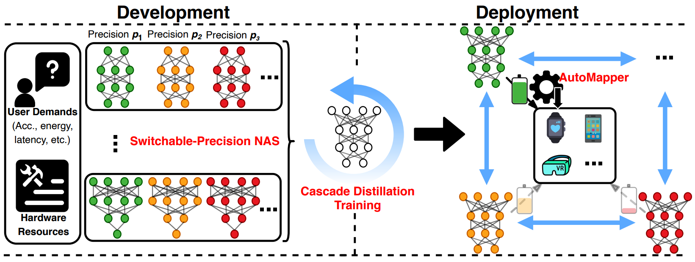
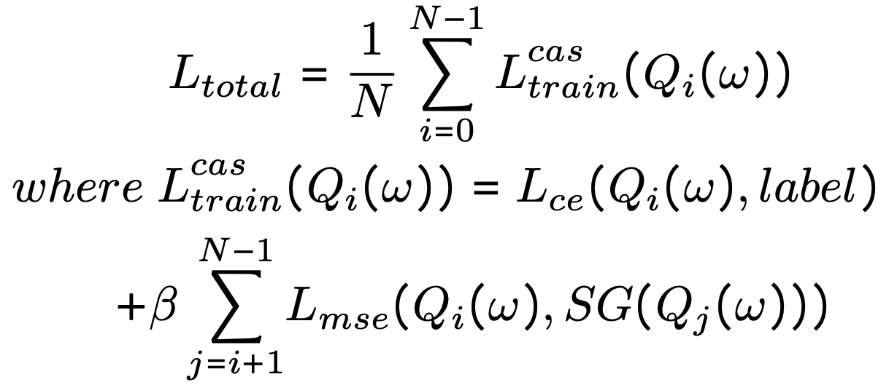
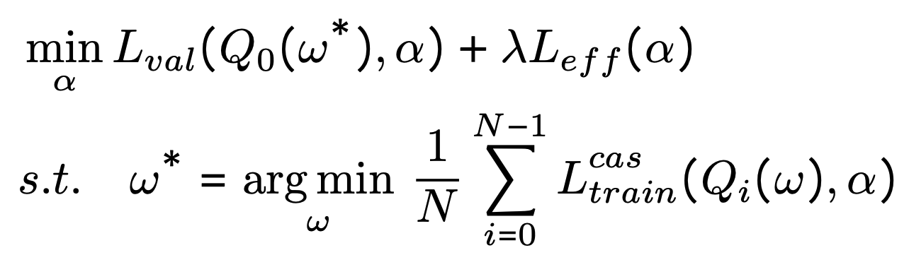
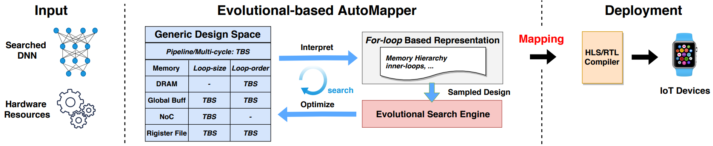
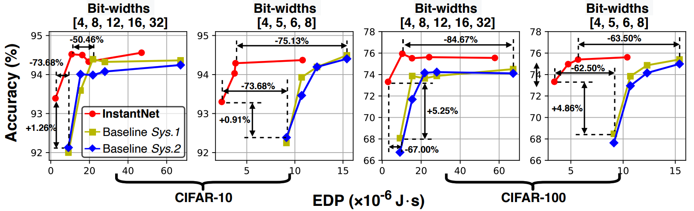

# InstantNet: Automated Generation and Deployment of Instantaneously Switchable-Precision Networks

***Yonggan Fu***, Zhongzhi Yu, Yongan Zhang, Yifan Jiang, Chaojian Li, Yongyuan Liang, Mingchao Jiang, Zhangyang Wang, Yingyan Lin

Accepted at DAC 2021 [[Paper Link]](https://arxiv.org/pdf/2104.10853.pdf).


## Overview

- The promise of Deep Neural Network (DNN) powered Internet of Thing (IoT) devices has motivated a tremendous demand for automated solutions to enable fast development and deployment of efficient (1) DNNs equipped with instantaneous accuracy-efficiency trade-off capability to accommodate the timevarying resources at IoT devices and (2) dataflows to optimize DNNs’ execution efficiency on different devices. Therefore, we propose ***InstantNet*** to automatically generate and deploy instantaneously switchable-precision networks (SP-Nets) which operate at variable bit-widths.

<p align="center">
  
</p>


## Method

### Cascade Distillation Training (CDT)

- To generate SP-Nets of which the accuracy under all bit-widths are the same or even higher than that of DNNs customized for individual bit-widths, the proposed Cascade Distillation Training (CDT) adopts all higher precisions to guide the learning of the current precision, motivated by the fact that the quantization noises
of SP-Nets under adjacent or closer bit-widths are smaller.

<p align="center">
  
</p>

### Switchable-Precision NAS (SP-NAS)

- The proposed SP-NAS updates the weights based on our CDT method which explicitly incorporates switchable-precision property into the training process; and for updating the architecture parameters of SPNet, it activates only the weights under the lowest bit-width, for generating networks forced to inherently tackle SP-Nets’ bottleneck of high accuracy loss under the lowest bit-width.

<p align="center">
  
</p>

### Evolution-based AutoMapper

- The proposed AutoMapper aims to accept (1) DNNs (e.g., SP-Nets generated by our SP-NAS), (2) the target device, and (3) target hardware efficiency, and
then generate mapping methods that maximize both the task accuracy and hardware efficiency of the given SP-Nets under all bit-widths when being executed on the target device.

<p align="center">
  
</p>


## Results

- InstantNet generated systems consistently outperforms the SOTA baselines in terms of the trade-off between accuracy and EDP (a commonly-used hardware metric for ASIC) by achieving a higher or comparable accuracy and better EDP under lower bit-widths over the baselines.

<p align="center">
  
</p>


## Code Usage
- A two-stage process is needed to generate the final system, i.e., the search and training stage. The corresponding settings are specified in ***config_search.py*** and ***config_train.py***, respectively. In particular, plz specify the search settings in ***config_search.py*** and search the optimal SP-Nets through ***train_search.py***, and then specify training settings in ***config_train.py*** and train the searched arch from scratch through ***train.py*** (The best searched arch will be saved at ***ckpt/search/arch.pt*** which is the default path for ***train.py*** to read.)

### Prerequisites
- See ***env.yml*** for the complete conda environment. Create a new conda environment:
```
conda env create -f env.yml
conda activate pytorch
```


### Stage 1: Search via SP-NAS
1. Specify the search setting in ***config_search.py***:
```
C.dataset_path = "path-to-dataset"
C.flops_weight = 1e-9
```

2. Run ***train_search.py***: 
```
python train_search.py
```

### Stage 2: Train via CDT
1. Specify the training setting in ***config_train.py***:
```
C.dataset_path = "path-to-dataset"
C.load_path = "path-to-searched-arch"
```

2. Run ***train.py*** on each of your nodes: 
```
python train.py
```

Search/training logs: the searched arch ***ckpt/search/arch.pt*** the search logs ***ckpt/search/logs.txt*** and the training logs ***ckpt/finetune/logs.txt***.


## Citation
```
@article{fu2021instantnet,
  title={InstantNet: Automated Generation and Deployment of Instantaneously Switchable-Precision Networks},
  author={Fu, Yonggan and Yu, Zhongzhi and Zhang, Yongan and Jiang, Yifan and Li, Chaojian and Liang, Yongyuan and Jiang, Mingchao and Wang, Zhangyang and Lin, Yingyan},
  journal={arXiv preprint arXiv:2104.10853},
  year={2021}
}
```
